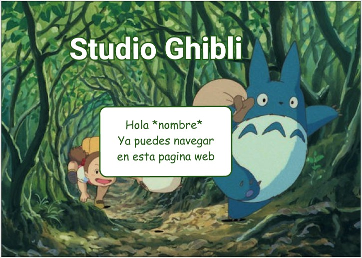

# Data Lovers

## Índice

* [1. Preámbulo](#1-preámbulo)
* [2. Resumen del proyecto](#2-resumen-del-proyecto)
* [3. Definición de producto](#3-definición-de-producto)
* [4. Historias de usuario](#4-historias-de-usuario)
* [5. Diseño de la interfaz](#5-diseño-de-la-interfaz)
* [6. Implemento de la interfaz](#6-implemento-de-la-interfaz)
* [7. Test unitarios](#7-test-initarios)
* [8. EXTRAS ](#8-extras)
* [9. Checklist](#9-checklist)

***

## 1. Preámbulo

Según [Forbes](https://www.forbes.com/sites/bernardmarr/2018/05/21/how-much-data-do-we-create-every-day-the-mind-blowing-stats-everyone-should-read),
el 90% de la data que existe hoy ha sido creada durante los últimos dos años.
Cada día generamos 2.5 millones de terabytes de datos, una cifra sin
precedentes.

No obstante, los datos por sí mismos son de poca utilidad. Para que esas
grandes cantidades de datos se conviertan en **información** fácil de leer para
los usuarios, necesitamos entender y procesar estos datos. Una manera simple de
hacerlo es creando _interfaces_ y _visualizaciones_.

En la siguiente imagen, podrás ver cómo con la data que que se ve en la parte
izquierda se puede construir una interfaz amigable y entendible por el usuario
al lado derecho.

## 2. Resumen del proyecto

En este proyecto se diseño y construyo una interfaz web donde se puede visualizar y manipular data del Studio Ghibli. La data de peliculas del estudio es filtrada por medio de la funcion filterData, ordenada por medio de sortData y la funcion calculate muentra el calculo de personajes por especie.

Data Usada: 

* [Studio Ghibli](src/data/ghibli/ghibli.json).
  En este set encontrarás una lista de las animaciones y sus personajes del
  [Studio Ghibli](https://ghiblicollection.com/).
  - [Investigación con seguidores de las animaciones del Studio Ghibli](src/data/ghibli/README.md)

## 3. Definición de producto

## ¿Quiénes son los principales usuarios del producto?
Los admiradores de Studio Ghibli, que desean ver información relacionada a sus películas.

## ¿Cuáles son los objetivos de estos usuarios en relación con el producto?
Revisar de la forma más didáctica posible, la información del Studio Ghibli.

## ¿Cuáles son los datos más relevantes que quieren ver en la interfaz y por qué?
En base a los hallazgos de la investigación rápida se decidió que estos son los datos más relevantes para ver en la interfaz:

- Películas: ¿Cuántas y cuáles son?
 * Título.
 * Descripción.
 * Fecha de lanzamiento.
 * Director y productor.
 * Personajes: ¿Cuántas y cuáles son?, características(nombre, edad, género, especie, etc).
- Especies que hay en cada animación.
- Directores y productores.
  * En qué películas participaron y cuantas fueron.

Se mostrará la data mediante:
- Navegador-sortData: ordenar de manera ascendente o descendente por año, director, productor y título.
- Buscador-filterData: filtra la data en base a palabras clave.
- En la parte principal de las películas, se mostrarán en el orden que aparecen en la data y tendam las siguientes caracteristias: nombre de la película,  fecha de lanzamiento, productor y director.

## ¿Cuándo utilizan o utilizarían el producto?
Cada vez que deseen ver la información mencionada anteriormente.

## 4. Historias de usuario

### Historia 1

Como: fanático del Studio Ghibli
Quiero: Botón para acceder a la página
Para: Ver la coleccion de peliculas animadas
Boceto —-> Figma —-> HTML —-> JS —-> CSS

Criterios de Aceptación:
- Se muestra información general del Studio Ghibli.
- El usuario puede ingresar su nombre en el campo de texto.
- El botón permite ir a la siguiente vista.
- Se muestra el mensaje de bienvenida.

### Historia 2

COMO: fanático del Studio Ghibli
Quiero: Display de películas.
PARA: Poder acceder a  la información de las animaciones.
Boceto —-> Figma —-> HTML —-> JS —-> CSS

Criterios de Aceptación:
- Se muestran las películas en orden que están en la data.
- Se muestra el póster de la película, el título, el director, el productor y año de lanzamiento.

### Historia 3

COMO: fanático del Studio Ghibli
Quiero: Un navegador donde se muestre las data por categorías.
PARA: Poder acceder a la información de las animaciones.
Boceto —-> Figma —-> HTML —-> JS —-> CSS

Criterios de Aceptación:
- Navegador asociado a la función sortData.
- Navegador que permite mostrar películas(A-Z), director(A-Z),  año de publicación (descendente) y productor(A-Z).
- Buscador e icono de búsqueda que permite encontrar películas, director, año de publicación y productor.

### Historia 4

COMO: fanático del Studio Ghibli
Quiero: Un buscador que permite filtrar datos en base a palabras clave.
PARA: Poder acceder a  la información de las animaciones.
Boceto —-> Figma —-> HTML —-> JS —-> CSS

Criterios de Aceptación:
- Vista del buscador con un icono de búsqueda 
- El buscador que permite encontrar películas por titulo, director, año de publicación y productor.
- No es case sensitive, filtra aunque no este escrito exactamente como en la data (minúsculas y mayusculas).

### Historia 5

COMO: fanático del Studio Ghibli
Quiero: Area del navegador para personajes.
PARA: Poder acceder a la clasificacion de personajes por especies.
Boceto —-> Figma —-> HTML —-> JS —-> CSS

Criterios de Aceptación:
- Área del navegador para el número de personajes por especies, asociada a la función calculate.
- Muestra el número de Humans, Totoros, Witches,... 

### Historia 6: Display de cada película

COMO: fanático del Studio Ghibli
Quiero: dar click sobre las portadas.
PARA: Ver la información de las películas mostradas/encontradas.
Boceto —-> Figma —-> HTML —-> JS —-> CSS

Criterios de Aceptación:
- Se muestra la información de la película seleccionada.
- Vista de poster, titulo, año de publicacion, director, productor y descripcion.
- Flecha para volver a la historia anterior.

## 5. Diseño de la interfaz

### Boceto en Jamboard

### Boceto en [Figma](https://www.figma.com/file/WVZCI2KxsbbzgGisbMviXd/Proyecto2?node-id=107%3A8)

## 6. Implemento de la interfaz

### Vista desktop 

### Vista celular 

## 7. Test unitarios

## 8. EXTRAS 

### [Trello](https://trello.com/b/eIfQD6zm/data-lovers)

### Objetivos de aprendizaje

* Carol
* [Shirley](https://fortunate-burst-cdb.notion.site/0ab6a628cb9f49f990841587cf251cdf?v=b235a3767cc94fde88cffa59623f8728)
* [Yaisa](https://yaisa.notion.site/88b7358f470a447c8ffe5d65510e9ef2?v=c442f23fd8e74968a154d30a8d8b4836)

## 9. Checklist

* [ ] Usa VanillaJS.
* [ ] Pasa linter (`npm run pretest`)
* [ ] Pasa tests (`npm test`)
* [ ] Pruebas unitarias cubren un mínimo del 70% de statements, functions y
  lines y branches.
* [ ] Incluye _Definición del producto_ clara e informativa en `README.md`.
* [ ] Incluye historias de usuario en `README.md`.
* [ ] Incluye _sketch_ de la solución (prototipo de baja fidelidad) en
  `README.md`.
* [ ] Incluye _Diseño de la Interfaz de Usuario_ (prototipo de alta fidelidad)
  en `README.md`.
* [ ] Incluye link a Zeplin en `README.md`.
* [ ] Incluye la `Plan de acción` (Objetivos de Aprendizaje priorizados) de cada programadora en el `README.md` o otro documento.
* [ ] Incluye el listado de problemas que detectaste a través de tests de
  usabilidad en el `README.md`.
* [ ] UI: Muestra lista y/o tabla con datos y/o indicadores.
* [ ] UI: Permite ordenar data por uno o más campos (asc y desc).
* [ ] UI: Permite filtrar data en base a una condición.
* [ ] UI: Es _responsive_.
